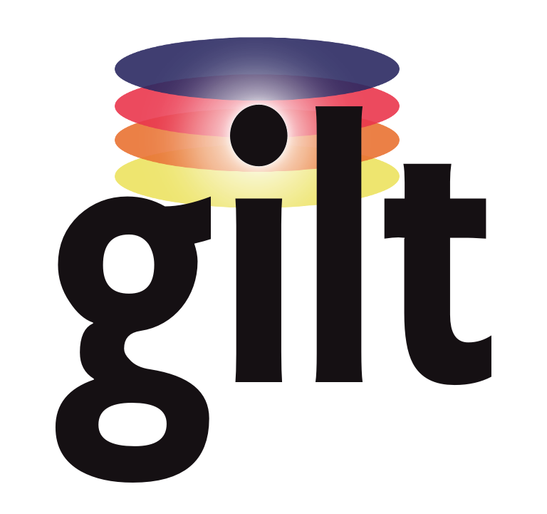

# Gilt

Gilt is a tool which aims to make repo management, manageable.  Gilt
clones repositories at a particular version, then overlays the repository to
the provided destination.  An alternate approach to "vendoring".

What makes Gilt interesting, is the ability to overlay particular files and/or
directories from the specified repository to given destinations. Originally,
this was quite helpful for those using Ansible, since libraries, plugins, and
playbooks are often shared, but Ansible's [Galaxy][] has no mechanism to handle
this.  Currently, this is proving useful for overlaying [Helm charts][].

 

## Documentation

[Installation][] | [Usage][] | [Documentation][]

[Installation]: https://retr0h.github.io/go-gilt/installation
[Usage]: https://retr0h.github.io/go-gilt/usage
[Documentation]: https://retr0h.github.io/go-gilt/

## License

The [MIT][] License.

The logo is licensed under the [Creative Commons NoDerivatives 4.0 License][],
and designed by [@nanotron][].
If you have some other use in mind, contact us.

[Galaxy]: https://docs.ansible.com/ansible/latest/reference_appendices/galaxy.html
[Helm charts]: https://helm.sh/docs/topics/charts/
[MIT]: LICENSE
[Creative Commons NoDerivatives 4.0 License]: https://creativecommons.org/licenses/by-nd/4.0/
[@nanotron]: https://github.com/nanotron
